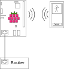

# Mobile Computing: Notification Matrix

This project is createt for the lecture "MobileComputin" at the HTWG Konstanz Department of Computer Science.
The project needs an [outliner](https://github.com/DanielHipp/mobileComputing/wiki/Outliner) and contains an [paper](https://github.com/DanielHipp/mobileComputing_Raspberry/blob/master/docs/MobileComputing-Paper.pdf) and a presentation.

In this repository the Raspberry Pi code can be found. To see the sourcecode for the Android App take a look at the other [Repo](https://github.com/DanielHipp/mobileComputing)

## Introduction
This is the backend on the Raspberry Pi 3, that receives input (text and images) from a smartphone and displays it on a 16x16 dot matrix.

To achieve this, the Raspberry Pi activates its WiFi-Chip in Access Point mode, enabling the smartphone to connect to the Raspberry Pi. To sustain normal use of the smartphone, the Raspberry Pi uses NAT and DHCP to act as any normal WiFi router. So the smartphone can access the internet normally.

The Raspberry Pi listens only on a special port to receive the data to be displayed on the dot matrix.

Here is an overview of the networking with the Raspberry Pi, smartphone and the existing internet router:

## Installation
1. Install Raspian lite on a microSD card for your Raspberry Pi 3
2. Connect your Raspberry Pi to the Internet via LAN
3. Install Git ($ sudo apt-get install git)
4. Clone this repo on your Raspberry Pi
5. Run setup.sh as root
6. Connect the dot matrix via SPI to the Raspberry Pi
7. Reboot the Raspberry Pi
8. Connect your Smartphone to the Pi's WiFi network "MC-RaspberryPi"
    - Password: "0123456789"
    - You will have internet access through the LAN connection of the Raspberry Pi
9. Run the App on your smartphone
10. Done :thumbsup:

## Technical
[Max7219 Datasheet](https://datasheets.maximintegrated.com/en/ds/MAX7219-MAX7221.pdf)

[simple guide for max7219](https://tutorials-raspberrypi.de/led-max7219-dot-matrix-projekt-uebersicht/)

